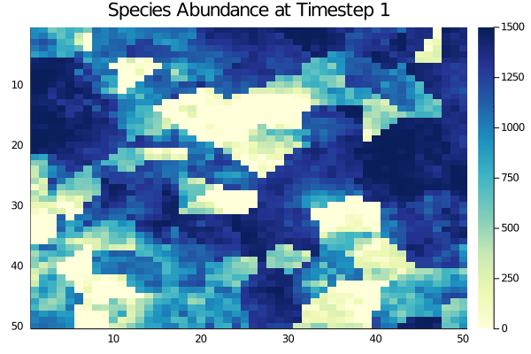

# MetaRange

[](https://janablechschmidt.github.io/MetaRange.jl/stable/)
[](https://janablechschmidt.github.io/MetaRange.jl/dev/)
[](https://github.com/janablechschmidt/MetaRange.jl/actions/workflows/CI.yml?query=branch%3Amain)
[](https://github.com/invenia/BlueStyle)

MetaRange is a process-based mechanistic species distribution model, that explicitly includes stochastic
as well as metabolic processes. It is intended to be used as a general mechanistic distribution model for
theoretical questions as well as a predictive tool to model future species distributions based on empirical data.

## About

MetaRange integrates spatially-explicit demographic and behavioral processes with a niche- and metabolism-based approach. For each species, it considers species-specific environmental preferences and regulates demographic processes via the Metabolic Theory of Ecology.

The user can model the spatial distribution of a species in any landscape. Niches are defined by temperature and precipitation and can include further niche axis if desired by the user. Demographic processes are adapted via the Metabolic Theory of Ecology, such that both biomass of the organism as well as temperature in a given patch influence demographic rates.

A manuscript introducing MetaRange.jl is currently in preparation.

## Installation

The package can be installed from github through the inbuilt Julia package manager. Open a Julia REPL, e.g. by running the command `julia` in your command line in the place where your Julia is installed. Then, type `]` to enter the Pkg REPL mode and run:

```text
pkg> add https://github.com/janablechschmidt/MetaRange.jl.git
```

Alternatively you can use `Pkg` directly by running:

```julia
julia> import Pkg; Pkg.add(url = "https://github.com/janablechschmidt/MetaRange.jl.git")
```

This will download all scripts, files, and dependencies that are necessary to run the model.

MetaRange is being developed and tested on the current 1.9 release on Windows and Linux.

## Usage

MetaRange works by first creating a simulation struct and then calling the function `run_simulation!()` on the object. There are two main functions to execute a simulation. First, your input must be read and initialized with the `read_input()` function. This function will create a `Simulation_Data` struct, typically named `SD` (but you can name it whatever you want), which contains all input data as well as the structures that will hold the results, but are empty initially. `SD` can then be given to the function `run_simulation(SD)`, which will modify it to include the simulation results.  
Here is a minimum example on a random landscape, which will run a simulation of 20 timesteps without needing any input to be provided:

```julia
using MetaRange
SD = default_run_data()
run_simulation!(SD)
```

Alternatively, you can use our `examples` folder. It is recommended to save the folder where you would like the simulation data to be saved. For the static example we provide, your code would look like this:

```julia
using MetaRange
SD = read_input("./static/configuration.csv")
run_simulation!(SD)
```

Running the simulation with your own data you need to specify a .csv file with configuration parameters for the model, a path to a species folder containing .csv files with species-specific parameters, and an environment folder which includes the landscape, again in .csv format.
If no explicit paths to these folders are given the model will look for a `species` and `environment` folder in the same directory as the specified configuration file.
A detailed explanation on how to run the simulation with your own data and folder structure can be found in the [documentation](https://janablechschmidt.github.io/MetaRange.jl/dev/).

Results can be viewed by inspecting the relevant parts of the `Simulation_Data` object. There are also several visualization functions that will plot the output (see [documentation](https://janablechschmidt.github.io/MetaRange.jl/dev/) for all functions and their description). Output images can be static or dynamic. For example, to create a GIF of the abundance of a species for each timestep of the simulation call:

```julia
abundance_gif(SD)
```



For further examples of usage and how to use different data for simulations as well as further description of the used objects, please refer to the [documentation](https://janablechschmidt.github.io/MetaRange.jl/dev/)

## Style Guide

We try to adhere to the [Blue Style Guide](https://github.com/invenia/BlueStyle) and the tool that we use is [JuliaFormatter](https://docs.juliahub.com/JuliaFormatter/). If you want to contribute to this project you can install the package on your Julia environment with:

```bash
julia -e 'using Pkg; Pkg.add("JuliaFormatter")'
```

Then, from the root of the project run:

```bash
julia -e 'using JuliaFormatter; format(".", BlueStyle(), overwrite=true)'
```

JuliaFormatter will traverse the directory structure and modify in-place (`overwrite=true`) all .jl files following the Blue Style.

We also run automated code style checks for pull requests using the same tool.

## License

This project is licensed under the terms of the **MIT** license. See `LICENSE` for more information.

## Acknowledgements

This module is an adaptation of the [metaRange](https://metarange.github.io/metaRange/) model written in R and C++.
